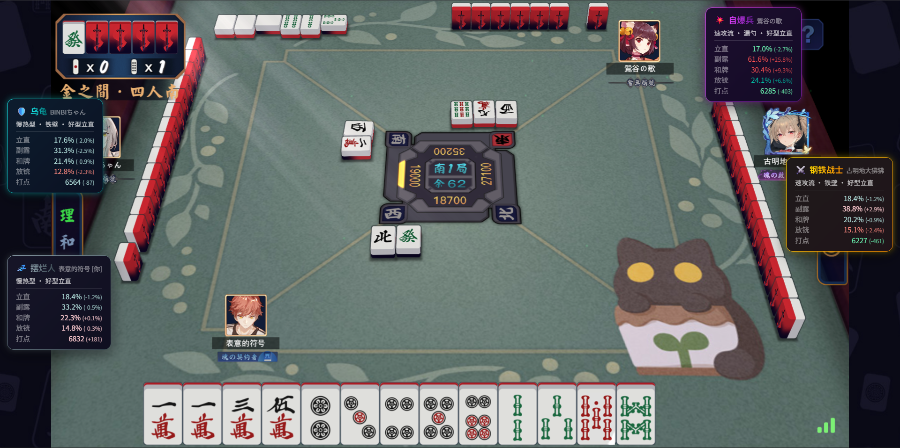

# 雀魂对局风格分析助手

一个雀魂对局的 Tampermonkey 脚本，实时分析对手的打牌风格和危险度，帮助你更好地了解牌桌局势。

## 功能特性

- **风格识别**：自动识别对手的打牌风格（钢铁战士、狂战士、忍者、乌龟等 9 种原型）
- **数据分析**：展示立直率、副露率、和牌率、放铳率、平均打点等关键数据
- **危险度评估**：综合评估对手的进攻强度和防守能力
- **策略建议**：根据对手风格提供针对性的应对策略
- **实时更新**：对局开始后自动抓取数据并渲染信息卡

## 支持范围

- ✅ 四麻对局（当前稳定支持）
- ⏳ 三麻对局（开发中）

## 安装

### 1. 安装 Tampermonkey

- [Chrome / Edge](https://chrome.google.com/webstore/detail/tampermonkey/dhdgffkkebhmkfjojejmpbldmpobfkfo)
- [Firefox](https://addons.mozilla.org/firefox/addon/tampermonkey/)

### 2. 安装脚本

👉 [点击安装最新版本](https://github.com/Cooper-X-Oak/majstyle.js/raw/main/dist/%E9%9B%80%E9%AD%82%E5%9B%9B%E9%BA%BB%E9%A3%8E%E6%A0%BC%E5%88%86%E6%9E%90%E5%8A%A9%E6%89%8B-v2.2.3-beta.1.user.js)

也可以手动安装：

1. 下载 `dist/雀魂四麻风格分析助手-v2.2.3-beta.1.user.js`
2. 拖拽到浏览器窗口，或在 Tampermonkey 管理面板中导入
3. 点击”安装”

### 3. 效果展示



### 4. 使用说明

1. 打开雀魂网页端或客户端
2. 进入一桌对局并等待 2-3 秒
3. 脚本会自动抓取玩家数据并渲染信息卡
4. 点击任意信息卡可全局折叠或展开

注意：

- 对手需要有足够样本量（至少 50+ 场），分析结果才有参考价值
- 数据来源于公开的第三方统计接口，可能存在延迟或不准确

## 常见问题

**Q: 为什么看不到信息卡？**  
A: 请确保已进入对局并等待 2-3 秒，脚本需要时间抓取数据。如果对手是新号或样本量不足，可能无法显示。

**Q: 数据准确吗？**  
A: 数据来自第三方统计接口，仅供参考。实际对局中对手的状态和策略可能随时变化。

**Q: 会被封号吗？**  
A: 本脚本仅读取公开数据，不修改游戏行为，理论上不会被检测。但使用任何第三方脚本都存在风险，请自行判断。

## 更新日志

详见 [CHANGELOG.md](CHANGELOG.md)

## 开发

```bash
npm install
npm run build
npm run dev
```

如需推送到 GitHub：

```bash
npm run push
```

## 免责声明

本项目仅使用游戏公开暴露的数据与外部公开接口，不涉及破解或修改游戏行为。

本脚本提供的风格分析和策略建议仅供娱乐参考，纯属蛐蛐对手，不对分析准确性或策略有效性负责，也不保证能帮助上分。使用本脚本产生的任何后果由用户自行承担。
